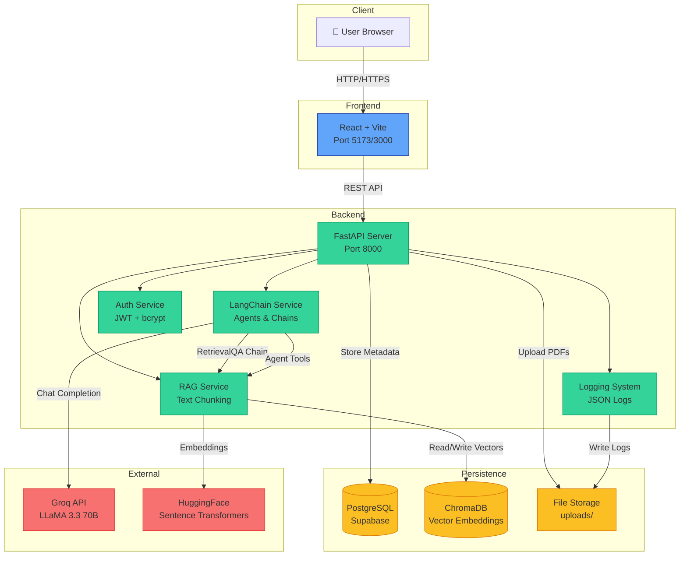

# System Architecture

## Overview

CourseMaster AI is a production-grade, multi-user AI tutoring platform built using modern agentic AI frameworks. The system leverages Retrieval Augmented Generation (RAG) with LangChain to provide personalized learning experiences through PDF-based knowledge extraction.

---

## Architecture Diagram



---

## Component Details

### 1. Frontend (React)
- **Technology**: React 18 + Vite
- **Styling**: Tailwind CSS
- **Routing**: React Router v6
- **State**: React Hooks
- **Features**:
  - User authentication (login/register)
  - PDF upload with drag-and-drop
  - Real-time chat interface
  - Interactive quiz system
  - Analytics dashboard

### 2. Backend (FastAPI)
- **Framework**: FastAPI 0.109+
- **API Design**: RESTful with OpenAPI docs
- **Authentication**: JWT tokens with bcrypt hashing
- **Middleware**: CORS, request logging, error handling
- **Routes**:
  - `/api/auth` - Authentication
  - `/api/pdf` - PDF management
  - `/api/chat` - Q&A system
  - `/api/quiz` - Quiz generation & submission
  - `/api/analytics` - Progress tracking

### 3. LangChain Service
- **Framework**: LangChain 0.1.0
- **LLM**: ChatGroq (Groq API)
- **Chains**:
  - `RetrievalQA`: RAG-based question answering
  - `ConversationalRetrievalChain`: Chat with memory
- **Agents**: Quiz generation with structured output
- **Prompts**: Custom system prompts for tutoring context

### 4. RAG Service
- **Vector Store**: ChromaDB 0.4.22
- **Embeddings**: `sentence-transformers/all-MiniLM-L6-v2`
- **Chunking**: 512 tokens, 50 overlap
- **Retrieval**: Cosine similarity search
- **Operations**:
  - PDF text extraction (PyPDF)
  - Text chunking & embedding
  - Semantic search

### 5. Database (PostgreSQL)
- **Provider**: Supabase (cloud)
- **ORM**: SQLAlchemy 2.0
- **Tables**:
  - `users` - User accounts
  - `pdfs` - PDF metadata
 - `chats` - Conversation history
  - `quizzes` - Quiz results
  - `weaknesses` - Concept tracking

### 6. Logging System
- **Format**: Structured JSON
- **Levels**: DEBUG, INFO, WARNING, ERROR
- **Handlers**:
  - Console (stdout)
  - File rotation (10MB, 5 backups)
- **Middleware**: Request/response logging

---

## Data Flow

### PDF Upload & Indexing
```
User uploads PDF
  → FastAPI validates file
  → PyPDF extracts text
  → RAG Service chunks text (512 tokens)
  → Sentence Transformers creates embeddings
  → ChromaDB stores vectors
  → PostgreSQL stores metadata
```

### Chat Q&A (RAG)
```
User asks question
  → LangChain embeds question
  → ChromaDB retrieves similar chunks (cosine similarity)
  → LangChain RetrievalQA chain formats prompt
  → Groq API generates answer
  → Response with source citations returned
  → Conversation saved to PostgreSQL
```

### Quiz Generation
```
User requests quiz (topic + difficulty)
  → RAG retrieves relevant content
  → LangChain Agent structures prompt
  → Groq generates JSON questions
  → Questions stored in PostgreSQL
  → User submits answers
  → Groq analyzes incorrect answers
  → Weaknesses extracted & tracked
```

---

## Security

- **Authentication**: JWT tokens (HS256)
- **Password**: bcrypt hashing
- **CORS**: Configured origins only
- **Input**: Pydantic validation
- **Authorization**: User-level data isolation

---

## Scalability

- **API**: Async/await for concurrent requests
- **Database**: Connection pooling (SQLAlchemy)
- **Vector Store**: ChromaDB persistence
- **Containerization**: Docker + Docker Compose
- **Logs**: Rotation to prevent disk fill

---

## Deployment

```bash
# Single-command deployment
docker-compose up -d

# Services start in order:
# 1. ChromaDB (vector database)
# 2. Backend (FastAPI)
# 3. Frontend (React + Nginx)
```

**Access:**
- Frontend: http://localhost:3000
- Backend API: http://localhost:8000
- API Docs: http://localhost:8000/docs
